# Advanced SOC Lab v2.0

> A hands-on, fully open-source Security Operations Center lab running 12 production-grade tools via Docker Compose. Built for SOC Level 2/3 analyst training, blue team skill development, and adversary emulation — all on a single machine.

**Author:** Sandeep Mothukuri  
**Stack:** 12 tools · 100% free · MITRE ATT&CK v14 · Docker Compose  
**Minimum:** 16 GB RAM · 50 GB disk · Linux / WSL2 / macOS

---

## Screenshots

### Command Center Portal
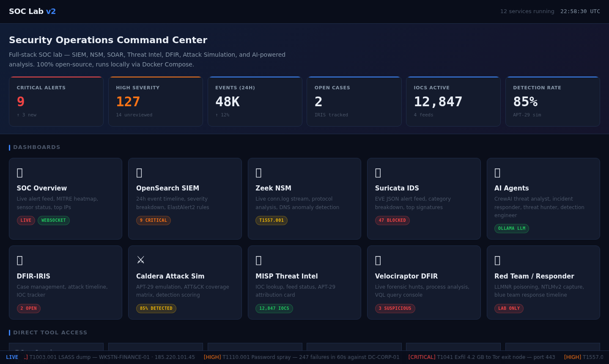

### SOC Overview — Live Alert Feed
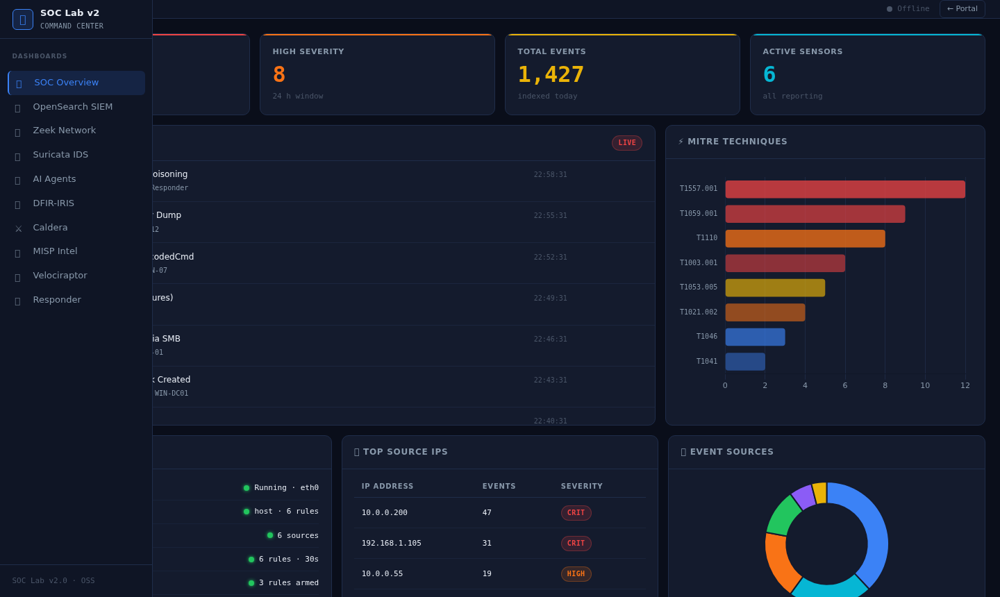

### OpenSearch SIEM — 24h Event Timeline
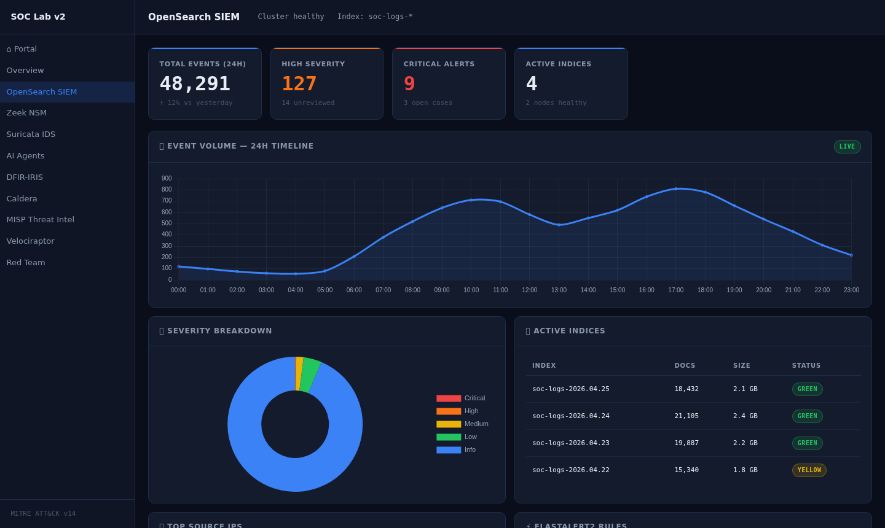

### Zeek NSM — Network Traffic Analysis
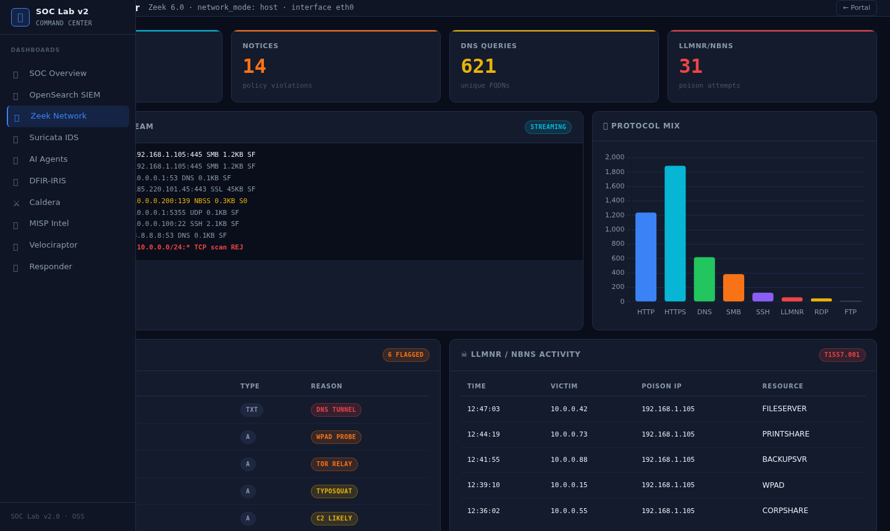

### Suricata IDS — EVE JSON Alert Feed
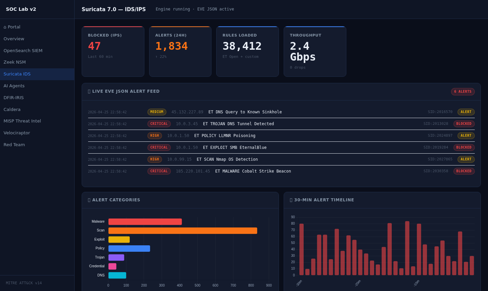

### AI Agents — CrewAI Threat Analysis
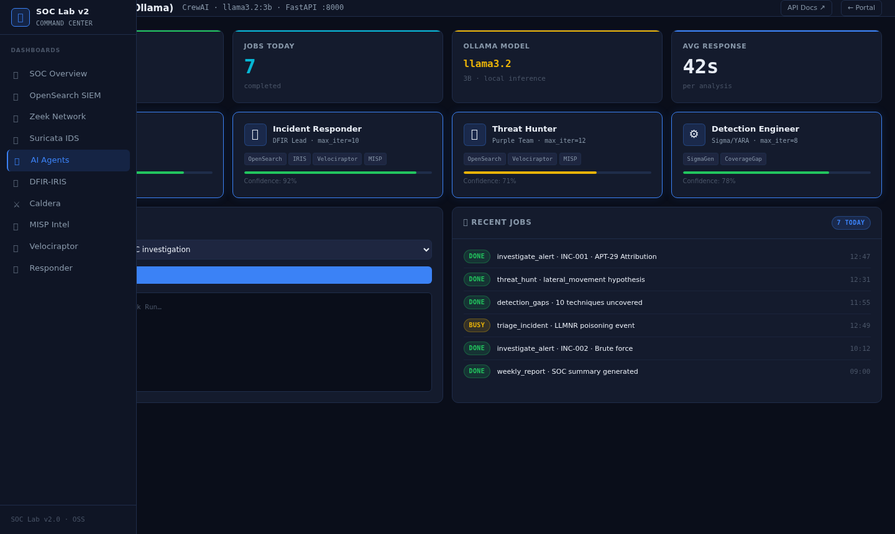

### DFIR-IRIS — Case Management & Attack Timeline
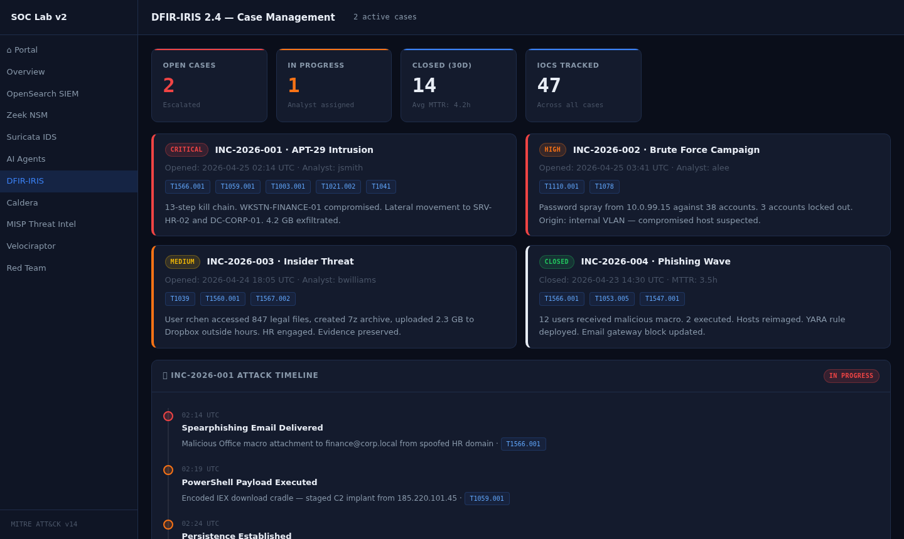

### MITRE Caldera — Adversary Emulation
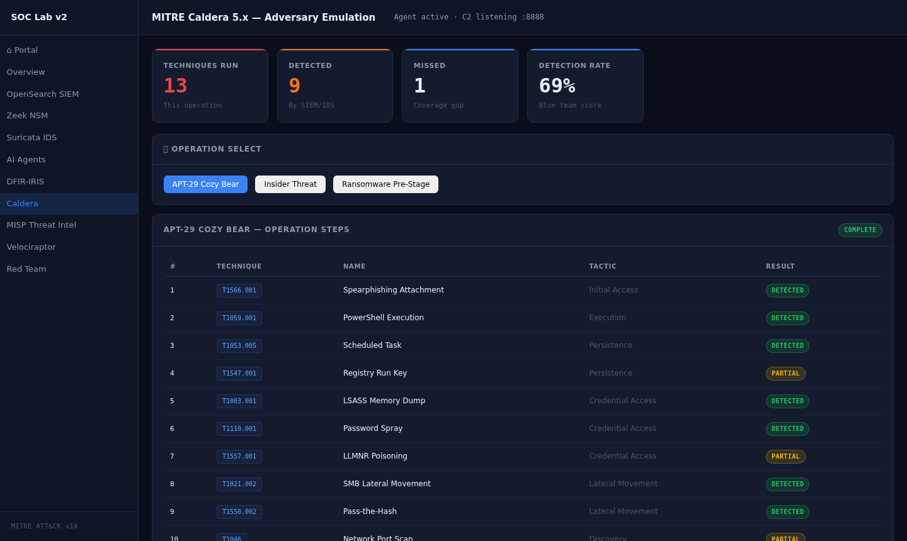

### MISP — Threat Intelligence Platform
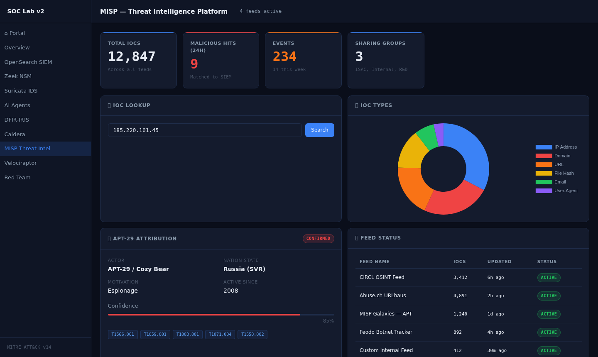

### Velociraptor — Live Forensics & DFIR
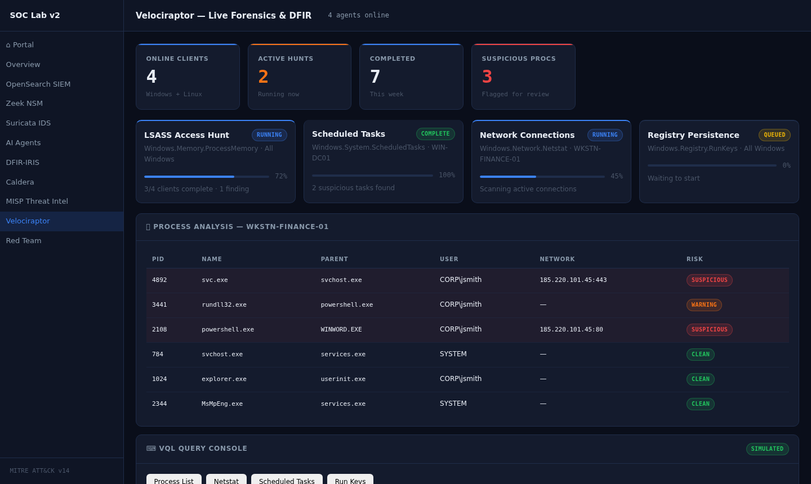

### Red Team — Responder + LLMNR Poisoning
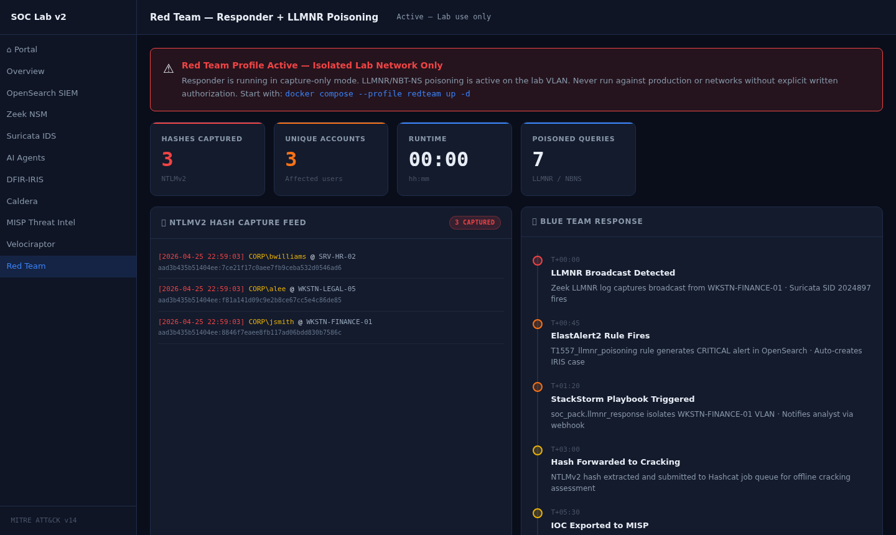

---

## Overview

The Advanced SOC Lab v2.0 is a complete, self-contained security operations environment designed for hands-on learning. Every component is open-source and orchestrated with Docker Compose, so you can spin up a full SOC stack in under 15 minutes.

### What You Get

| Layer | Tool | Purpose |
|---|---|---|
| **SIEM** | OpenSearch 2.13 + Dashboards | Log ingestion, search, visualization |
| **Log Pipeline** | Vector 0.38 | Unified log routing and transformation |
| **Detection** | ElastAlert2 | Rule-based alerting from OpenSearch |
| **Network NSM** | Zeek 6.0 + Suricata 7.0 | Packet-level network security monitoring |
| **SOAR** | StackStorm 3.8 | Automated response playbooks |
| **Case Mgmt** | DFIR-IRIS 2.4 | Incident tracking, timelines, IOCs |
| **Threat Intel** | MISP | IOC sharing, feeds, attribution |
| **DFIR** | Velociraptor | Live forensics, VQL hunting |
| **Attack Sim** | MITRE Caldera 5.x | Adversary emulation, ATT&CK mapping |
| **Red Team** | Responder | LLMNR/NBT-NS poisoning (lab profile) |
| **AI Analysis** | Ollama + CrewAI | LLM-powered SOC agents |

### Detection Rules (15 built-in)

| Rule | Technique | Severity |
|---|---|---|
| Brute Force / Password Spray | T1110.001 | High |
| LSASS Memory Dump | T1003.001 | Critical |
| PowerShell Encoded Command | T1059.001 | High |
| Lateral Movement via SMB | T1021.002 | Critical |
| LLMNR/NBT-NS Poisoning | T1557.001 | High |
| Scheduled Task Creation | T1053.005 | Medium |
| Registry Run Key Persistence | T1547.001 | Medium |
| DNS Tunneling C2 | T1071.004 | High |
| Pass-the-Hash | T1550.002 | Critical |
| Network Port Scan | T1046 | Medium |
| Data Exfiltration over C2 | T1041 | Critical |
| Defender Disabled | T1562.001 | Critical |
| Spearphishing Attachment | T1566.001 | High |
| Bulk File Collection | T1039 | Medium |
| After-Hours Account Login | T1078 | Medium |

### AI Agents

| Agent | Role | Capability |
|---|---|---|
| Threat Analyst | APT attribution, TTP mapping | Correlates IOCs with threat actors |
| Incident Responder | Triage and containment | Generates response playbooks |
| Threat Hunter | Proactive hunting | Builds VQL queries from hypotheses |
| Detection Engineer | Rule creation | Writes ElastAlert2 and Sigma rules |

---

## Architecture

```
Internet / Lab Network
        │
   ┌────▼─────────────────────────────────────────────┐
   │              Docker Compose Network               │
   │                                                   │
   │  ┌──────────┐  ┌──────────┐  ┌────────────────┐  │
   │  │  Zeek    │  │ Suricata │  │  Log Sources   │  │
   │  │ (NSM)    │  │ (IDS)    │  │  Sysmon/Win    │  │
   │  └────┬─────┘  └────┬─────┘  └───────┬────────┘  │
   │       └─────────────┴────────────────┘           │
   │                     │ Vector 0.38                 │
   │               ┌─────▼──────┐                      │
   │               │ OpenSearch │◄─── ElastAlert2      │
   │               │  (SIEM)    │                      │
   │               └─────┬──────┘                      │
   │                     │                             │
   │        ┌────────────┼────────────┐                │
   │        ▼            ▼            ▼                │
   │   StackStorm    DFIR-IRIS      MISP               │
   │   (SOAR)       (Cases)        (Threat Intel)      │
   │        │            │            │                │
   │        └────────────┴────────────┘                │
   │                     │                             │
   │              ┌──────▼──────┐                      │
   │              │  AI Agents  │                      │
   │              │ Ollama/Crew │                      │
   │              └─────────────┘                      │
   │                                                   │
   │  ┌──────────────┐   ┌──────────────┐              │
   │  │    Caldera   │   │  Velociraptor│              │
   │  │  (Attack Sim)│   │    (DFIR)    │              │
   │  └──────────────┘   └──────────────┘              │
   └───────────────────────────────────────────────────┘
```

---

## Requirements

| Requirement | Minimum | Recommended |
|---|---|---|
| RAM | 14 GB | 16–32 GB |
| Disk | 30 GB | 50 GB |
| CPU | 4 cores | 8 cores |
| OS | Ubuntu 22.04 / Debian 12 / WSL2 | Ubuntu 22.04 LTS |
| Docker | 24.x | Latest |
| Docker Compose | v2.x | Latest |

---

## Installation

### Step 1 — Clone the Repository

```bash
git clone https://github.com/YOUR_USERNAME/advanced-soc-lab-v2.git
cd advanced-soc-lab-v2
```

### Step 2 — Make Scripts Executable

```bash
chmod +x setup.sh health-check.sh simulate-attack.sh
```

### Step 3 — Run the Setup Script

The setup script handles everything: environment config, kernel tuning, Docker image pulls, and staged service deployment.

```bash
sudo ./setup.sh
```

The script runs in 4 stages:

```
── Stage 1/4 — Core infrastructure (OpenSearch, Vector) ──
── Stage 2/4 — Security tools (MISP, IRIS, Velociraptor) ──
── Stage 3/4 — SOAR + Detection (StackStorm, ElastAlert2) ──
── Stage 4/4 — AI agents + Attack simulation (Ollama, Caldera) ──
```

> **First run:** Ollama downloads `llama3.2:3b` (~2 GB). Total setup time: 10–20 minutes depending on internet speed.

### Step 4 — Verify All Services Are Healthy

```bash
./health-check.sh
```

Expected output:

```
  Advanced SOC Lab v2.0 — Health Check

  Core Infrastructure
  ✔  OpenSearch         cluster:green · 0 documents
  ✔  OpenSearch Node 1  container running
  ✔  OpenSearch Node 2  container running
  ✔  OpenSearch Dashboards  HTTP 200
  ✔  Vector Pipeline    container running

  Security Tools
  ✔  DFIR-IRIS          HTTP 200
  ✔  MISP               HTTP 200
  ✔  Velociraptor       HTTP 200
  ✔  StackStorm         HTTP 200
  ✔  ElastAlert2        container running

  Attack Simulation & AI
  ✔  MITRE Caldera      HTTP 200
  ✔  AI Agents API      HTTP 200
  ✔  Ollama LLM         HTTP 200
  ✔  WebSocket Streamer container running

  Results: 14 passed  0 failed  1 warnings  (15 checks)
  All critical services healthy.
```

### Step 5 — Open the Dashboard Portal

Open `dashboards/index.html` in your browser. All 10 dashboards are accessible from the portal.

---

## Configuration

### Environment Variables

Credentials are auto-generated by `setup.sh` into `.env`. Review and customize before use:

```bash
cat .env
```

Key variables:

| Variable | Default | Description |
|---|---|---|
| `OPENSEARCH_PASSWORD` | auto-generated | OpenSearch admin password |
| `IRIS_SECRET_KEY` | auto-generated | DFIR-IRIS Flask secret |
| `CALDERA_RED_PASSWORD` | `changeme` | Caldera red team password |
| `CALDERA_BLUE_PASSWORD` | `changeme` | Caldera blue team password |
| `MISP_KEY` | auto-generated | MISP API key |
| `ST2_AUTH_TOKEN` | auto-generated | StackStorm auth token |

> **Important:** Change `CALDERA_RED_PASSWORD` and `CALDERA_BLUE_PASSWORD` before deploying.

### Kernel Parameters

OpenSearch requires a higher memory map limit. The setup script applies this automatically:

```bash
sudo sysctl -w vm.max_map_count=262144

# Make permanent
echo "vm.max_map_count=262144" | sudo tee -a /etc/sysctl.conf
```

### Endpoint Agent Installation

**Windows (PowerShell — run as Administrator):**

```powershell
# Install Velociraptor agent
$url = "http://YOUR_LAB_IP:8889/api/v1/GetFile?name=velociraptor-agent-windows.exe"
Invoke-WebRequest -Uri $url -OutFile "velociraptor-agent.exe"
.\velociraptor-agent.exe --config agent.config.yaml service install

# Install Sysmon for detailed process logging
Invoke-WebRequest -Uri https://download.sysinternals.com/files/Sysmon.zip -OutFile Sysmon.zip
Expand-Archive Sysmon.zip -DestinationPath Sysmon
.\Sysmon\Sysmon64.exe -accepteula -i config/sysmon/sysmon-config.xml
```

**Linux:**

```bash
# Install Velociraptor agent
curl -L http://YOUR_LAB_IP:8889/api/v1/GetFile?name=velociraptor-agent-linux \
  -o velociraptor-agent
chmod +x velociraptor-agent
sudo ./velociraptor-agent --config agent.config.yaml service install
```

---

## Running Attack Simulations

The `simulate-attack.sh` script injects realistic MITRE ATT&CK events directly into OpenSearch for analyst training.

### APT-29 Kill Chain (13 Techniques)

```bash
./simulate-attack.sh apt29
```

Injects events for: T1566.001 → T1059.001 → T1053.005 → T1547.001 → T1003.001 → T1110.001 → T1557.001 → T1021.002 → T1550.002 → T1046 → T1041 → T1071.004 → T1562.001

### Brute Force / Password Spray

```bash
./simulate-attack.sh bruteforce
```

Simulates password spray across 12 accounts with account lockout events.

### Insider Threat

```bash
./simulate-attack.sh insider
```

Simulates bulk file collection, cloud upload exfiltration, and log deletion.

### Run All Scenarios

```bash
./simulate-attack.sh all
```

### Verify Events Were Indexed

```bash
./simulate-attack.sh verify
```

---

## Service URLs

| Service | URL | Credentials |
|---|---|---|
| **Dashboard Portal** | `dashboards/index.html` | — |
| **OpenSearch Dashboards** | http://localhost:5601 | admin / `$OPENSEARCH_PASSWORD` |
| **DFIR-IRIS** | http://localhost:4460 | admin / `changeme` |
| **MITRE Caldera** | http://localhost:8888 | red / `$CALDERA_RED_PASSWORD` |
| **Velociraptor** | http://localhost:8889 | admin / `changeme` |
| **MISP** | http://localhost:4000 | admin@admin.test / `admin` |
| **StackStorm** | http://localhost:9000 | st2admin / `changeme` |
| **AI Agents API** | http://localhost:8000/docs | — |
| **Ollama** | http://localhost:11434 | — |
| **OpenSearch API** | http://localhost:9200 | admin / `$OPENSEARCH_PASSWORD` |

---

## Optional: Red Team Profile

The Responder container (LLMNR/NBT-NS poisoning) is disabled by default. Start it only on an isolated lab network:

```bash
# Start red team profile
docker compose --profile redteam up -d

# Stop red team profile
docker compose --profile redteam down
```

> **Warning:** Never run Responder on a production network or any network without explicit written authorization. Lab network only.

---

## Stopping and Managing the Lab

```bash
# Stop all services (keep data)
docker compose down

# Stop and delete all data volumes
docker compose down -v

# Restart a single service
docker compose restart elastalert2

# View logs for a service
docker compose logs -f ai-agents

# Check resource usage
docker stats
```

---

## Project Structure

```
advanced-soc-lab-v2/
├── docker-compose.yml          # All 12 services + red team profile
├── .env.example                # Environment variable template
├── setup.sh                    # One-command deployment script
├── health-check.sh             # Service health validation
├── simulate-attack.sh          # Attack scenario injection
├── README.md                   # This file
│
├── dashboards/                 # Web UI dashboards
│   ├── index.html              # Main portal
│   ├── soc-theme.css           # Shared dark design system
│   ├── 01_soc_overview.html    # Live alert feed + MITRE heatmap
│   ├── 02_opensearch_siem.html # 24h timeline + index stats
│   ├── 03_zeek_network.html    # conn.log stream + DNS anomalies
│   ├── 04_suricata_ids.html    # EVE JSON feed + top signatures
│   ├── 05_ai_agents.html       # CrewAI agent console
│   ├── 06_iris_cases.html      # Incident cases + IOC tracker
│   ├── 07_caldera_attack.html  # ATT&CK coverage matrix
│   ├── 08_misp_ti.html         # IOC lookup + feed status
│   ├── 09_velociraptor.html    # Hunt progress + VQL console
│   └── 10_responder_redteam.html # NTLMv2 capture + blue response
│
├── config/
│   ├── opensearch/             # OpenSearch + Dashboards config
│   ├── elastalert2/rules/      # 15 detection rules (YAML)
│   ├── caldera/operations/     # APT-29 + Insider Threat operations
│   ├── nginx/                  # Reverse proxy config
│   └── misp/                   # MISP server config
│
├── ai-agents/                  # CrewAI SOC agents
│   ├── agents/                 # threat_analyst, incident_responder,
│   │                           # threat_hunter, detection_engineer
│   ├── tools/                  # OpenSearch, MISP, IRIS, Velociraptor tools
│   └── api.py                  # FastAPI + WebSocket server
│
├── soar-playbooks/             # StackStorm automation packs
├── detection-rules/            # Sigma rules + ElastAlert2 configs
├── endpoint-configs/           # Sysmon, Velociraptor, Zeek configs
├── cloud-logs/                 # AWS CloudTrail, Azure, GCP parsers
└── threat-hunting/             # Pre-built hunting queries
```

---

## Troubleshooting

| Problem | Cause | Fix |
|---|---|---|
| OpenSearch won't start | `vm.max_map_count` too low | `sudo sysctl -w vm.max_map_count=262144` |
| Cluster status RED | Not enough memory | Close other apps; ensure 16 GB free |
| Caldera agent offline | Firewall blocking port 8888 | `ufw allow 8888` |
| Ollama model missing | Download failed | `docker exec ollama ollama pull llama3.2:3b` |
| Container keeps restarting | Out of disk space | Free space: `docker system prune` |
| ElastAlert2 no alerts | No data in OpenSearch | Run `./simulate-attack.sh apt29` first |
| MISP login fails | Container still initializing | Wait 2–3 min after startup |

### View Service Logs

```bash
docker compose logs -f opensearch-node1
docker compose logs -f elastalert2
docker compose logs -f ai-agents
docker compose logs -f caldera
```

### Full Reset

```bash
docker compose down -v
sudo rm -rf data/
./setup.sh
```

---

## Learning Exercises

Once the lab is running, work through these exercises in order:

1. **Alert Triage** — Run `./simulate-attack.sh apt29`, open OpenSearch Dashboards, and triage the 13 injected alerts by severity
2. **Case Creation** — Open DFIR-IRIS and create a new case for the APT-29 intrusion. Add IOCs and link MITRE techniques
3. **Network Forensics** — Review the Zeek Network dashboard for LLMNR poisoning and DNS tunneling indicators
4. **Threat Hunting** — Use the Velociraptor VQL console to hunt for suspicious scheduled tasks and LSASS access
5. **Detection Gap Analysis** — Run the Caldera APT-29 operation and review which techniques were detected vs missed
6. **SOAR Automation** — Trigger a StackStorm playbook by injecting a brute force scenario and observing automated response
7. **AI-Assisted Analysis** — Use the AI Agents dashboard to run the APT-29 attribution scenario and review the LLM analysis
8. **Red Team (optional)** — Enable the red team profile, capture NTLMv2 hashes via Responder, and follow the blue team response timeline

---

## Contributing

Pull requests are welcome. Please open an issue first to discuss significant changes.

1. Fork the repository
2. Create a feature branch: `git checkout -b feature/my-detection-rule`
3. Commit your changes: `git commit -m 'Add T1055 process injection detection rule'`
4. Push to the branch: `git push origin feature/my-detection-rule`
5. Open a Pull Request

---

## License

MIT License — free to use, modify, and distribute for educational and research purposes.

---

## Author

**Sandeep Mothukuri**

Built as a hands-on SOC training environment for blue team skill development, threat detection practice, and adversary emulation research.

> *"The best way to learn detection is to run the attack yourself."*

---

*Advanced SOC Lab v2.0 · 12 tools · 100% open-source · MITRE ATT&CK v14*
